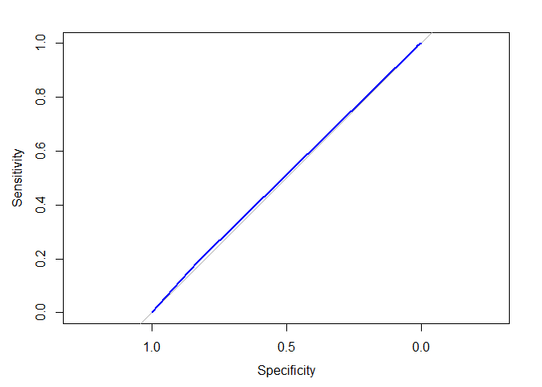

```r
# {r, echo = FALSE, results='hide'}
# if we used both 'echo=TRUE' and 'results=hide' the pipe would not work properly
# if we used 'echo = FALSE' and 'results=hide' we would have only messages (i.e. attaching package) If we don't want them we set 'error = FALSE', 'warning = FALSE', and 'message = FALSE'.
library(dplyr)
```

```
## 
## Attaching package: 'dplyr'
```

```
## The following objects are masked from 'package:stats':
## 
##     filter, lag
```

```
## The following objects are masked from 'package:base':
## 
##     intersect, setdiff, setequal, union
```

Supervised learning: train a machine to learn from prior examples. When the concept to be learned.

## Classification with Nearest Neighbors

## Recognizing a road sign with kNN


```r
# Load the 'class' package
library(class)

# load datasets
signs<-read.csv("signs.csv")
next_sign<-read.csv("next_sign.csv")

str(signs)
```

```
## 'data.frame':	146 obs. of  49 variables:
##  $ sign_type: chr  "pedestrian" "pedestrian" "pedestrian" "pedestrian" ...
##  $ r1       : int  155 142 57 22 169 75 136 149 13 123 ...
##  $ g1       : int  228 217 54 35 179 67 149 225 34 124 ...
##  $ b1       : int  251 242 50 41 170 60 157 241 28 107 ...
##  $ r2       : int  135 166 187 171 231 131 200 34 5 83 ...
##  $ g2       : int  188 204 201 178 254 89 203 45 21 61 ...
##  $ b2       : int  101 44 68 26 27 53 107 1 11 26 ...
##  $ r3       : int  156 142 51 19 97 214 150 155 123 116 ...
##  $ g3       : int  227 217 51 27 107 144 167 226 154 124 ...
##  $ b3       : int  245 242 45 29 99 75 134 238 140 115 ...
##  $ r4       : int  145 147 59 19 123 156 171 147 21 67 ...
##  $ g4       : int  211 219 62 27 147 169 218 222 46 67 ...
##  $ b4       : int  228 242 65 29 152 190 252 242 41 52 ...
##  $ r5       : int  166 164 156 42 221 67 171 170 36 70 ...
##  $ g5       : int  233 228 171 37 236 50 158 191 60 53 ...
##  $ b5       : int  245 229 50 3 117 36 108 113 26 26 ...
##  $ r6       : int  212 84 254 217 205 37 157 26 75 26 ...
##  $ g6       : int  254 116 255 228 225 36 186 37 108 26 ...
##  $ b6       : int  52 17 36 19 80 42 11 12 44 21 ...
##  $ r7       : int  212 217 211 221 235 44 26 34 13 52 ...
##  $ g7       : int  254 254 226 235 254 42 35 45 27 45 ...
##  $ b7       : int  11 26 70 20 60 44 10 19 25 27 ...
##  $ r8       : int  188 155 78 181 90 192 180 221 133 117 ...
##  $ g8       : int  229 203 73 183 110 131 211 249 163 109 ...
##  $ b8       : int  117 128 64 73 9 73 236 184 126 83 ...
##  $ r9       : int  170 213 220 237 216 123 129 226 83 110 ...
##  $ g9       : int  216 253 234 234 236 74 109 246 125 74 ...
##  $ b9       : int  120 51 59 44 66 22 73 59 19 12 ...
##  $ r10      : int  211 217 254 251 229 36 161 30 13 98 ...
##  $ g10      : int  254 255 255 254 255 34 190 40 27 70 ...
##  $ b10      : int  3 21 51 2 12 37 10 34 25 26 ...
##  $ r11      : int  212 217 253 235 235 44 161 34 9 20 ...
##  $ g11      : int  254 255 255 243 254 42 190 44 23 21 ...
##  $ b11      : int  19 21 44 12 60 44 6 35 18 20 ...
##  $ r12      : int  172 158 66 19 163 197 187 241 85 113 ...
##  $ g12      : int  235 225 68 27 168 114 215 255 128 76 ...
##  $ b12      : int  244 237 68 29 152 21 236 54 21 14 ...
##  $ r13      : int  172 164 69 20 124 171 141 205 83 106 ...
##  $ g13      : int  235 227 65 29 117 102 142 229 125 69 ...
##  $ b13      : int  244 237 59 34 91 26 140 46 19 9 ...
##  $ r14      : int  172 182 76 64 188 197 189 226 85 102 ...
##  $ g14      : int  228 228 84 61 205 114 171 246 128 67 ...
##  $ b14      : int  235 143 22 4 78 21 140 59 21 6 ...
##  $ r15      : int  177 171 82 211 125 123 214 235 85 106 ...
##  $ g15      : int  235 228 93 222 147 74 221 252 128 69 ...
##  $ b15      : int  244 196 17 78 20 22 201 67 21 9 ...
##  $ r16      : int  22 164 58 19 160 180 188 237 83 43 ...
##  $ g16      : int  52 227 60 27 183 107 211 254 125 29 ...
##  $ b16      : int  53 237 60 29 187 26 227 53 19 11 ...
```

```r
str(next_sign)
```

```
## 'data.frame':	1 obs. of  48 variables:
##  $ r1 : int 204
##  $ g1 : int 227
##  $ b1 : int 220
##  $ r2 : int 196
##  $ g2 : int 59
##  $ b2 : int 51
##  $ r3 : int 202
##  $ g3 : int 67
##  $ b3 : int 59
##  $ r4 : int 204
##  $ g4 : int 227
##  $ b4 : int 220
##  $ r5 : int 236
##  $ g5 : int 250
##  $ b5 : int 234
##  $ r6 : int 242
##  $ g6 : int 252
##  $ b6 : int 235
##  $ r7 : int 205
##  $ g7 : int 148
##  $ b7 : int 131
##  $ r8 : int 190
##  $ g8 : int 50
##  $ b8 : int 43
##  $ r9 : int 179
##  $ g9 : int 70
##  $ b9 : int 57
##  $ r10: int 242
##  $ g10: int 229
##  $ b10: int 212
##  $ r11: int 190
##  $ g11: int 50
##  $ b11: int 43
##  $ r12: int 193
##  $ g12: int 51
##  $ b12: int 44
##  $ r13: int 170
##  $ g13: int 197
##  $ b13: int 196
##  $ r14: int 190
##  $ g14: int 50
##  $ b14: int 43
##  $ r15: int 190
##  $ g15: int 47
##  $ b15: int 41
##  $ r16: int 165
##  $ g16: int 195
##  $ b16: int 196
```

```r
# Create a vector of labels
sign_types <- signs$sign_type

# Classify the next sign observed
# Note that we need to remove the first column from the "signs" dataset 
# because this columns is "sign_types".
# If we do not get rid of the column we run into coercion problems
knn(train = signs[-1], test = next_sign, cl = sign_types)
```

```
## [1] stop
## Levels: pedestrian speed stop
```

## Exploring the traffic sign dataset


```r
# Examine the structure of the signs dataset
str(signs)
```

```
## 'data.frame':	146 obs. of  49 variables:
##  $ sign_type: chr  "pedestrian" "pedestrian" "pedestrian" "pedestrian" ...
##  $ r1       : int  155 142 57 22 169 75 136 149 13 123 ...
##  $ g1       : int  228 217 54 35 179 67 149 225 34 124 ...
##  $ b1       : int  251 242 50 41 170 60 157 241 28 107 ...
##  $ r2       : int  135 166 187 171 231 131 200 34 5 83 ...
##  $ g2       : int  188 204 201 178 254 89 203 45 21 61 ...
##  $ b2       : int  101 44 68 26 27 53 107 1 11 26 ...
##  $ r3       : int  156 142 51 19 97 214 150 155 123 116 ...
##  $ g3       : int  227 217 51 27 107 144 167 226 154 124 ...
##  $ b3       : int  245 242 45 29 99 75 134 238 140 115 ...
##  $ r4       : int  145 147 59 19 123 156 171 147 21 67 ...
##  $ g4       : int  211 219 62 27 147 169 218 222 46 67 ...
##  $ b4       : int  228 242 65 29 152 190 252 242 41 52 ...
##  $ r5       : int  166 164 156 42 221 67 171 170 36 70 ...
##  $ g5       : int  233 228 171 37 236 50 158 191 60 53 ...
##  $ b5       : int  245 229 50 3 117 36 108 113 26 26 ...
##  $ r6       : int  212 84 254 217 205 37 157 26 75 26 ...
##  $ g6       : int  254 116 255 228 225 36 186 37 108 26 ...
##  $ b6       : int  52 17 36 19 80 42 11 12 44 21 ...
##  $ r7       : int  212 217 211 221 235 44 26 34 13 52 ...
##  $ g7       : int  254 254 226 235 254 42 35 45 27 45 ...
##  $ b7       : int  11 26 70 20 60 44 10 19 25 27 ...
##  $ r8       : int  188 155 78 181 90 192 180 221 133 117 ...
##  $ g8       : int  229 203 73 183 110 131 211 249 163 109 ...
##  $ b8       : int  117 128 64 73 9 73 236 184 126 83 ...
##  $ r9       : int  170 213 220 237 216 123 129 226 83 110 ...
##  $ g9       : int  216 253 234 234 236 74 109 246 125 74 ...
##  $ b9       : int  120 51 59 44 66 22 73 59 19 12 ...
##  $ r10      : int  211 217 254 251 229 36 161 30 13 98 ...
##  $ g10      : int  254 255 255 254 255 34 190 40 27 70 ...
##  $ b10      : int  3 21 51 2 12 37 10 34 25 26 ...
##  $ r11      : int  212 217 253 235 235 44 161 34 9 20 ...
##  $ g11      : int  254 255 255 243 254 42 190 44 23 21 ...
##  $ b11      : int  19 21 44 12 60 44 6 35 18 20 ...
##  $ r12      : int  172 158 66 19 163 197 187 241 85 113 ...
##  $ g12      : int  235 225 68 27 168 114 215 255 128 76 ...
##  $ b12      : int  244 237 68 29 152 21 236 54 21 14 ...
##  $ r13      : int  172 164 69 20 124 171 141 205 83 106 ...
##  $ g13      : int  235 227 65 29 117 102 142 229 125 69 ...
##  $ b13      : int  244 237 59 34 91 26 140 46 19 9 ...
##  $ r14      : int  172 182 76 64 188 197 189 226 85 102 ...
##  $ g14      : int  228 228 84 61 205 114 171 246 128 67 ...
##  $ b14      : int  235 143 22 4 78 21 140 59 21 6 ...
##  $ r15      : int  177 171 82 211 125 123 214 235 85 106 ...
##  $ g15      : int  235 228 93 222 147 74 221 252 128 69 ...
##  $ b15      : int  244 196 17 78 20 22 201 67 21 9 ...
##  $ r16      : int  22 164 58 19 160 180 188 237 83 43 ...
##  $ g16      : int  52 227 60 27 183 107 211 254 125 29 ...
##  $ b16      : int  53 237 60 29 187 26 227 53 19 11 ...
```

```r
# Count the number of signs of each type
table(signs$sign_type)
```

```
## 
## pedestrian      speed       stop 
##         46         49         51
```

```r
# Check r10's average red level by sign type
aggregate(r10 ~ sign_type, data = signs, mean)
```

```
##    sign_type       r10
## 1 pedestrian 113.71739
## 2      speed  80.63265
## 3       stop 132.39216
```

As expected, stop signs tend to have a higher average red value. This is how kNN identifies similar signs.

## Classifying a collection of road signs


```r
test_signs<-read.csv("test_signs.csv")

# Use kNN to identify the test road signs
sign_types <- signs$sign_type
signs_pred <- knn(train = signs[-1], test = test_signs[-1], cl = sign_types)

# Create a confusion matrix of the predicted versus actual values
signs_actual <- test_signs$sign_type
table(signs_pred, signs_actual)
```

```
##             signs_actual
## signs_pred   pedestrian speed stop
##   pedestrian         19     2    0
##   speed               0    17    0
##   stop                0     2   19
```

```r
# Compute the accuracy
mean(signs_pred == signs_actual)
```

```
## [1] 0.9322034
```

## The k of knn

With smaller neighborhoods, kNN can identify more subtle patterns in the data.

## Testing other 'k' values


```r
signs_test<-test_signs # They renamed the dataframe on Data Camp

# Compute the accuracy of the baseline model (default k = 1)
k_1 <- knn(train = signs[-1], test = signs_test[-1], cl = sign_types)
mean(k_1 == signs_actual)
```

```
## [1] 0.9322034
```

```r
# Modify the above to set k = 7
k_7 <- knn(train = signs[-1], test = signs_test[-1], cl = sign_types, k = 7)
mean(k_7 == signs_actual)
```

```
## [1] 0.9491525
```

```r
# Set k = 15 and compare to the above
k_15 <- knn(train = signs[-1], test = signs_test[-1], cl = sign_types, k = 15)
mean(k_15 == signs_actual)
```

```
## [1] 0.8983051
```

## Seeing how the neighbors voted

To see which predictions are close(r) to unanimous.


```r
# Use the prob parameter to get the proportion of votes for the winning class
sign_pred <- knn(train = signs[-1], test = signs_test[-1], cl = sign_types, prob = TRUE, k = 7)

# Get the "prob" attribute from the predicted classes
sign_prob <- attr(sign_pred, "prob")

# Examine the first several predictions
head(sign_pred)
```

```
## [1] pedestrian pedestrian pedestrian stop       pedestrian pedestrian
## Levels: pedestrian speed stop
```

```r
# Examine the proportion of votes for the winning class
head(sign_prob)
```

```
## [1] 0.5714286 0.5714286 0.8571429 0.5714286 0.8571429 0.5714286
```

## Data preparation for kNN

normalization

## Understanding Bayesian methods


```r
library(naivebayes)
```

```
## naivebayes 0.9.7 loaded
```

## Computing probabilities


```r
where9am<-read.csv("where9am.csv")
str(where9am)
```

```
## 'data.frame':	91 obs. of  2 variables:
##  $ daytype : chr  "weekday" "weekday" "weekday" "weekend" ...
##  $ location: chr  "office" "office" "office" "home" ...
```

```r
str(where9am$daytype)
```

```
##  chr [1:91] "weekday" "weekday" "weekday" "weekend" "weekend" "weekday" ...
```

```r
str(where9am$location)
```

```
##  chr [1:91] "office" "office" "office" "home" "home" "campus" "home" ...
```

```r
table(where9am$daytype)
```

```
## 
## weekday weekend 
##      65      26
```

```r
table(where9am$location)
```

```
## 
## appointment      campus        home      office 
##           1          10          41          39
```

```r
# Compute P(A) 
p_A <- nrow(subset(where9am, location == "office"))/nrow(where9am)

# Compute P(B)
p_B <- nrow(subset(where9am, daytype == "weekday"))/nrow(where9am)

# Compute the observed P(A and B)
p_AB <- nrow(subset(where9am, location == "office", daytype == "weekday"))/nrow(where9am)

# Compute P(A | B) and print its value
p_A_given_B <- p_AB/p_B
p_A_given_B
```

```
## [1] 0.6
```

## A simple Naive Bayes location model


```r
# Build the location prediction model
locmodel <- naive_bayes(location ~ daytype, data = where9am)
```

```
## Warning: naive_bayes(): Feature daytype - zero probabilities are present.
## Consider Laplace smoothing.
```

```r
# Predict Thursday's 9am location
# First create "newdata"
thursday9am<-factor(c("weekday"), levels = c("weekday", "weekend")) %>% data.frame()
names(thursday9am)<-"daytype"; thursday9am
```

```
##   daytype
## 1 weekday
```

```r
predict(locmodel, newdata = thursday9am)
```

```
## [1] office
## Levels: appointment campus home office
```

```r
# Predict Saturdays's 9am location
saturday9am<-factor(c("weekend"), levels = c("weekday", "weekend")) %>% data.frame()
names(saturday9am)<-"daytype"; saturday9am
```

```
##   daytype
## 1 weekend
```

```r
predict(locmodel, newdata = saturday9am)
```

```
## [1] home
## Levels: appointment campus home office
```

## Examining "raw" probabilities


```r
# The 'naivebayes' package is loaded into the workspace
# and the Naive Bayes 'locmodel' has been built

# Examine the location prediction model
locmodel
```

```
## 
## ================================== Naive Bayes ================================== 
##  
##  Call: 
## naive_bayes.formula(formula = location ~ daytype, data = where9am)
## 
## --------------------------------------------------------------------------------- 
##  
## Laplace smoothing: 0
## 
## --------------------------------------------------------------------------------- 
##  
##  A priori probabilities: 
## 
## appointment      campus        home      office 
##  0.01098901  0.10989011  0.45054945  0.42857143 
## 
## --------------------------------------------------------------------------------- 
##  
##  Tables: 
## 
## --------------------------------------------------------------------------------- 
##  ::: daytype (Bernoulli) 
## --------------------------------------------------------------------------------- 
##          
## daytype   appointment    campus      home    office
##   weekday   1.0000000 1.0000000 0.3658537 1.0000000
##   weekend   0.0000000 0.0000000 0.6341463 0.0000000
## 
## ---------------------------------------------------------------------------------
```

```r
# Obtain the predicted probabilities for Thursday at 9am
predict(locmodel, thursday9am , type = "prob")
```

```
##      appointment    campus      home office
## [1,]  0.01538462 0.1538462 0.2307692    0.6
```

```r
# Obtain the predicted probabilities for Saturday at 9am
predict(locmodel, saturday9am , type = "prob")
```

```
##       appointment       campus      home      office
## [1,] 3.838772e-05 0.0003838772 0.9980806 0.001497121
```

## Understanding NB's "naivety"


```r
locations<-read.csv("locations.csv")
head(locations)
```

```
##   X daytype hourtype location
## 1 1 weekday    night     home
## 2 2 weekday    night     home
## 3 3 weekday    night     home
## 4 4 weekday    night     home
## 5 5 weekday    night     home
## 6 6 weekday    night     home
```

```r
# The 'naivebayes' package is loaded into the workspace already

# Build a NB model of location
locmodel <- naive_bayes(location ~ daytype + hourtype, 
data = locations)
```

```
## Warning: naive_bayes(): Feature daytype - zero probabilities are present.
## Consider Laplace smoothing.
```

```
## Warning: naive_bayes(): Feature hourtype - zero probabilities are present.
## Consider Laplace smoothing.
```

```r
# Predict Brett's location on a weekday afternoon
weekday_afternoon <- locations[13,]
predict(locmodel, newdata = weekday_afternoon)
```

```
## Warning: predict.naive_bayes(): more features in the newdata are provided as
## there are probability tables in the object. Calculation is performed based on
## features to be found in the tables.
```

```
## [1] office
## Levels: appointment campus home office restaurant store theater
```

```r
# Predict Brett's location on a weekday evening
weekday_evening <- locations[19,]
predict(locmodel, newdata = weekday_evening)
```

```
## Warning: predict.naive_bayes(): more features in the newdata are provided as
## there are probability tables in the object. Calculation is performed based on
## features to be found in the tables.
```

```
## [1] home
## Levels: appointment campus home office restaurant store theater
```

## Preparing for unforeseen circumstances


```r
# The 'naivebayes' package is loaded into the workspace already
# The Naive Bayes location model (locmodel) has already been built

# Observe the predicted probabilities for a weekend afternoon
weekend_afternoon<-locations[85,]
predict(locmodel, newdata = weekend_afternoon, type = "prob")
```

```
## Warning: predict.naive_bayes(): more features in the newdata are provided as
## there are probability tables in the object. Calculation is performed based on
## features to be found in the tables.
```

```
##      appointment       campus      home      office restaurant      store
## [1,]  0.02462883 0.0004802622 0.8439145 0.003349521  0.1111338 0.01641922
##          theater
## [1,] 7.38865e-05
```

```r
# Build a new model using the Laplace correction
locmodel2 <- naive_bayes(location ~ daytype + hourtype, data = locations, laplace = 1)

# Observe the new predicted probabilities for a weekend afternoon
predict(locmodel2, newdata = weekend_afternoon, type = "prob")
```

```
## Warning: predict.naive_bayes(): more features in the newdata are provided as
## there are probability tables in the object. Calculation is performed based on
## features to be found in the tables.
```

```
##      appointment      campus      home      office restaurant      store
## [1,]  0.02013872 0.006187715 0.8308154 0.007929249  0.1098743 0.01871085
##          theater
## [1,] 0.006343697
```

## Making binary predictions with regression

## Building simple logistic regression models


```r
donors<-read.csv("donors.csv")
dim(donors)
```

```
## [1] 93462    13
```

```r
head(donors)
```

```
##   donated veteran bad_address age has_children wealth_rating interest_veterans
## 1       0       0           0  60            0             0                 0
## 2       0       0           0  46            1             3                 0
## 3       0       0           0  NA            0             1                 0
## 4       0       0           0  70            0             2                 0
## 5       0       0           0  78            1             1                 0
## 6       0       0           0  NA            0             0                 0
##   interest_religion pet_owner catalog_shopper recency  frequency  money
## 1                 0         0               0 CURRENT   FREQUENT MEDIUM
## 2                 0         0               0 CURRENT   FREQUENT   HIGH
## 3                 0         0               0 CURRENT   FREQUENT MEDIUM
## 4                 0         0               0 CURRENT   FREQUENT MEDIUM
## 5                 1         0               1 CURRENT   FREQUENT MEDIUM
## 6                 0         0               0 CURRENT INFREQUENT MEDIUM
```

```r
# Examine the dataset to identify potential independent variables
str(donors)
```

```
## 'data.frame':	93462 obs. of  13 variables:
##  $ donated          : int  0 0 0 0 0 0 0 0 0 0 ...
##  $ veteran          : int  0 0 0 0 0 0 0 0 0 0 ...
##  $ bad_address      : int  0 0 0 0 0 0 0 0 0 0 ...
##  $ age              : int  60 46 NA 70 78 NA 38 NA NA 65 ...
##  $ has_children     : int  0 1 0 0 1 0 1 0 0 0 ...
##  $ wealth_rating    : int  0 3 1 2 1 0 2 3 1 0 ...
##  $ interest_veterans: int  0 0 0 0 0 0 0 0 0 0 ...
##  $ interest_religion: int  0 0 0 0 1 0 0 0 0 0 ...
##  $ pet_owner        : int  0 0 0 0 0 0 1 0 0 0 ...
##  $ catalog_shopper  : int  0 0 0 0 1 0 0 0 0 0 ...
##  $ recency          : chr  "CURRENT" "CURRENT" "CURRENT" "CURRENT" ...
##  $ frequency        : chr  "FREQUENT" "FREQUENT" "FREQUENT" "FREQUENT" ...
##  $ money            : chr  "MEDIUM" "HIGH" "MEDIUM" "MEDIUM" ...
```

```r
# Explore the dependent variable
table(donors$donated)
```

```
## 
##     0     1 
## 88751  4711
```

```r
# Build the donation model
donation_model <- glm(donated ~ bad_address 
+ interest_religion + interest_veterans, 
                      data = donors, family = "binomial")

# Summarize the model results
summary(donation_model)
```

```
## 
## Call:
## glm(formula = donated ~ bad_address + interest_religion + interest_veterans, 
##     family = "binomial", data = donors)
## 
## Deviance Residuals: 
##     Min       1Q   Median       3Q      Max  
## -0.3480  -0.3192  -0.3192  -0.3192   2.5678  
## 
## Coefficients:
##                   Estimate Std. Error  z value Pr(>|z|)    
## (Intercept)       -2.95139    0.01652 -178.664   <2e-16 ***
## bad_address       -0.30780    0.14348   -2.145   0.0319 *  
## interest_religion  0.06724    0.05069    1.327   0.1847    
## interest_veterans  0.11009    0.04676    2.354   0.0186 *  
## ---
## Signif. codes:  0 '***' 0.001 '**' 0.01 '*' 0.05 '.' 0.1 ' ' 1
## 
## (Dispersion parameter for binomial family taken to be 1)
## 
##     Null deviance: 37330  on 93461  degrees of freedom
## Residual deviance: 37316  on 93458  degrees of freedom
## AIC: 37324
## 
## Number of Fisher Scoring iterations: 5
```

## Making a binary prediction


```r
# Estimate the donation probability
donors$donation_prob <- predict(donation_model, type = "response")

# Find the donation probability of the average prospect
mean(donors$donated)
```

```
## [1] 0.05040551
```

```r
# Predict a donation if probability of donation is greater than average (0.0504)
donors$donation_pred <- ifelse(donors$donation_prob > 0.0504, 1, 0)

# Calculate the model's accuracy
mean(donors$donation_pred == donors$donated)
```

```
## [1] 0.794815
```

```r
# Note: notice that mean(donors$donated) = mean(donors$donation_prob). Think why.
mean(donors$donation_prob)
```

```
## [1] 0.05040551
```

## The limitations of accuracy

In the previous exercise, you found that the logistic regression model made a correct prediction nearly 80% of the time. Despite this relatively high accuracy, the result is misleading due to the rarity of outcome being predicted.

The `donors` dataset is available in your workspace. What would the accuracy have been if a model had simply predicted "no donation" for each person?


```r
1 - sum(donors$donated)/length(donors$donated)
```

```
## [1] 0.9495945
```

With an accuracy of only 80%, the model is actually performing WORSE than if it were to predict non-donor for every record. This example shows that accuracy is a very misleading measure of model performance on imbalanced datasets

## Model performance tradeoffs

## Calculating ROC Curves and AUC


```r
# Load the pROC package
library(pROC)
```

```
## Type 'citation("pROC")' for a citation.
```

```
## 
## Attaching package: 'pROC'
```

```
## The following objects are masked from 'package:stats':
## 
##     cov, smooth, var
```

```r
# Create a ROC curve
ROC <- roc(donors$donated, donors$donation_prob)
```

```
## Setting levels: control = 0, case = 1
```

```
## Setting direction: controls < cases
```

```r
# Plot the ROC curve
plot(ROC, col = "blue")
```

<!-- -->

```r
# Calculate the area under the curve (AUC)
auc(ROC)
```

```
## Area under the curve: 0.5102
```

## Dummy variables, missing data, and interactions

## Coding categorical features


```r
# Convert the wealth rating to a factor
donors$wealth_levels <- factor(donors$wealth_rating, levels = c(0, 1, 2, 3), labels = c("Unknown", "Low", "Medium", "High"))

# Use relevel() to change reference category
donors$wealth_levels <- relevel(donors$wealth_levels, ref = "Medium")

# See how our factor coding impacts the model
summary(glm(donated ~ wealth_levels, data = donors, family = "binomial"))
```

```
## 
## Call:
## glm(formula = donated ~ wealth_levels, family = "binomial", data = donors)
## 
## Deviance Residuals: 
##     Min       1Q   Median       3Q      Max  
## -0.3320  -0.3243  -0.3175  -0.3175   2.4582  
## 
## Coefficients:
##                      Estimate Std. Error z value Pr(>|z|)    
## (Intercept)          -2.91894    0.03614 -80.772   <2e-16 ***
## wealth_levelsUnknown -0.04373    0.04243  -1.031    0.303    
## wealth_levelsLow     -0.05245    0.05332  -0.984    0.325    
## wealth_levelsHigh     0.04804    0.04768   1.008    0.314    
## ---
## Signif. codes:  0 '***' 0.001 '**' 0.01 '*' 0.05 '.' 0.1 ' ' 1
## 
## (Dispersion parameter for binomial family taken to be 1)
## 
##     Null deviance: 37330  on 93461  degrees of freedom
## Residual deviance: 37323  on 93458  degrees of freedom
## AIC: 37331
## 
## Number of Fisher Scoring iterations: 5
```

## Handling missing data


```r
# Find the average age among non-missing values
summary(donors$age)
```

```
##    Min. 1st Qu.  Median    Mean 3rd Qu.    Max.    NA's 
##    1.00   48.00   62.00   61.65   75.00   98.00   22546
```

```r
# Impute missing age values with the mean age
donors$imputed_age <- ifelse(is.na(donors$age), round(mean(donors$age, na.rm = TRUE),2), donors$age)

# Create missing value indicator for age
donors$missing_age <- ifelse(is.na(donors$age), 1, 0)
```

## Building a more sophisticated model


```r
# Build a recency, frequency, and money (RFM) model
rfm_model <- glm(donated ~ money + recency * frequency, data = donors, family = "binomial")

# Summarize the RFM model to see how the parameters were coded
summary(rfm_model)
```

```
## 
## Call:
## glm(formula = donated ~ money + recency * frequency, family = "binomial", 
##     data = donors)
## 
## Deviance Residuals: 
##     Min       1Q   Median       3Q      Max  
## -0.3696  -0.3696  -0.2895  -0.2895   2.7924  
## 
## Coefficients:
##                                   Estimate Std. Error z value Pr(>|z|)    
## (Intercept)                       -3.01142    0.04279 -70.375   <2e-16 ***
## moneyMEDIUM                        0.36186    0.04300   8.415   <2e-16 ***
## recencyLAPSED                     -0.86677    0.41434  -2.092   0.0364 *  
## frequencyINFREQUENT               -0.50148    0.03107 -16.143   <2e-16 ***
## recencyLAPSED:frequencyINFREQUENT  1.01787    0.51713   1.968   0.0490 *  
## ---
## Signif. codes:  0 '***' 0.001 '**' 0.01 '*' 0.05 '.' 0.1 ' ' 1
## 
## (Dispersion parameter for binomial family taken to be 1)
## 
##     Null deviance: 37330  on 93461  degrees of freedom
## Residual deviance: 36938  on 93457  degrees of freedom
## AIC: 36948
## 
## Number of Fisher Scoring iterations: 6
```

```r
# Compute predicted probabilities for the RFM model
rfm_prob <- predict(rfm_model, type = "response")

# Plot the ROC curve and find AUC for the new model
library(pROC)
ROC <- roc(donors$donated, rfm_prob)
```

```
## Setting levels: control = 0, case = 1
```

```
## Setting direction: controls < cases
```

```r
plot(ROC, col = "red")
```

<!-- -->

```r
auc(ROC)
```

```
## Area under the curve: 0.5785
```

## Automatic feature selection

- e.g. backward elimination and forward selection

- allows a model to be built in the absence of common sense

- in the predictive model setting, the meaning / interpretation of the model is of secondary importance

In general, Stepwise regression is not frequently used in disciplines outside of machine learning because

- It is not guaranteed to find the best possible model

- The stepwise regression procedure violates some statistical assumptions (amoung them principle of marginality?)

- It can result in a model that makes little sense in the real world

However, though stepwise regression is frowned upon, it may still be useful for building predictive models in the absence of another starting place.

Building a stepwise regression model


```r
# Specify a null model with no predictors
null_model <- glm(donated ~ 1, data = donors, family = "binomial")

# Specify the full model using all of the potential predictors
# NOTE the syntax "response ~ ."
full_model <- glm(donated ~ ., data = donors, family = "binomial")

# Use a forward stepwise algorithm to build a parsimonious model
step_model <- step(null_model, scope = list(lower = null_model, upper = full_model), direction = "forward")
```

```
## Start:  AIC=37332.13
## donated ~ 1
```

```
## Warning in add1.glm(fit, scope$add, scale = scale, trace = trace, k = k, : using
## the 70916/93462 rows from a combined fit
```

```
##                     Df Deviance   AIC
## + frequency          1    28502 37122
## + money              1    28621 37241
## + wealth_rating      1    28705 37326
## + has_children       1    28705 37326
## + age                1    28707 37328
## + imputed_age        1    28707 37328
## + wealth_levels      3    28704 37328
## + interest_veterans  1    28709 37330
## + donation_prob      1    28710 37330
## + donation_pred      1    28710 37330
## + catalog_shopper    1    28710 37330
## + pet_owner          1    28711 37331
## <none>                    28714 37332
## + interest_religion  1    28712 37333
## + recency            1    28713 37333
## + bad_address        1    28714 37334
## + veteran            1    28714 37334
## 
## Step:  AIC=37024.77
## donated ~ frequency
```

```
## Warning in add1.glm(fit, scope$add, scale = scale, trace = trace, k = k, : using
## the 70916/93462 rows from a combined fit
```

```
##                     Df Deviance   AIC
## + money              1    28441 36966
## + wealth_rating      1    28493 37018
## + wealth_levels      3    28490 37019
## + has_children       1    28494 37019
## + donation_prob      1    28498 37023
## + interest_veterans  1    28498 37023
## + catalog_shopper    1    28499 37024
## + donation_pred      1    28499 37024
## + age                1    28499 37024
## + imputed_age        1    28499 37024
## + pet_owner          1    28499 37024
## <none>                    28502 37025
## + interest_religion  1    28501 37026
## + recency            1    28501 37026
## + bad_address        1    28502 37026
## + veteran            1    28502 37027
## 
## Step:  AIC=36949.71
## donated ~ frequency + money
```

```
## Warning in add1.glm(fit, scope$add, scale = scale, trace = trace, k = k, : using
## the 70916/93462 rows from a combined fit
```

```
##                     Df Deviance   AIC
## + wealth_levels      3    28427 36942
## + wealth_rating      1    28431 36942
## + has_children       1    28432 36943
## + interest_veterans  1    28438 36948
## + donation_prob      1    28438 36949
## + catalog_shopper    1    28438 36949
## + donation_pred      1    28439 36949
## + age                1    28439 36949
## + imputed_age        1    28439 36949
## + pet_owner          1    28439 36949
## <none>                    28441 36950
## + interest_religion  1    28440 36951
## + recency            1    28441 36951
## + bad_address        1    28441 36951
## + veteran            1    28441 36952
## 
## Step:  AIC=36945.48
## donated ~ frequency + money + wealth_levels
```

```
## Warning in add1.glm(fit, scope$add, scale = scale, trace = trace, k = k, : using
## the 70916/93462 rows from a combined fit
```

```
##                     Df Deviance   AIC
## + has_children       1    28416 36937
## + age                1    28424 36944
## + imputed_age        1    28424 36944
## + interest_veterans  1    28424 36945
## + donation_prob      1    28424 36945
## + catalog_shopper    1    28425 36945
## + donation_pred      1    28425 36945
## <none>                    28427 36945
## + pet_owner          1    28425 36946
## + interest_religion  1    28426 36947
## + recency            1    28427 36947
## + bad_address        1    28427 36947
## + veteran            1    28427 36947
## 
## Step:  AIC=36938.4
## donated ~ frequency + money + wealth_levels + has_children
```

```
## Warning in add1.glm(fit, scope$add, scale = scale, trace = trace, k = k, : using
## the 70916/93462 rows from a combined fit
```

```
##                     Df Deviance   AIC
## + pet_owner          1    28413 36937
## + donation_prob      1    28413 36937
## + catalog_shopper    1    28413 36937
## + interest_veterans  1    28413 36937
## + donation_pred      1    28414 36938
## <none>                    28416 36938
## + interest_religion  1    28415 36939
## + age                1    28416 36940
## + imputed_age        1    28416 36940
## + recency            1    28416 36940
## + bad_address        1    28416 36940
## + veteran            1    28416 36940
## 
## Step:  AIC=36932.25
## donated ~ frequency + money + wealth_levels + has_children + 
##     pet_owner
```

```
## Warning in add1.glm(fit, scope$add, scale = scale, trace = trace, k = k, : using
## the 70916/93462 rows from a combined fit
```

```
##                     Df Deviance   AIC
## <none>                    28413 36932
## + donation_prob      1    28411 36932
## + interest_veterans  1    28411 36932
## + catalog_shopper    1    28412 36933
## + donation_pred      1    28412 36933
## + age                1    28412 36933
## + imputed_age        1    28412 36933
## + recency            1    28413 36934
## + interest_religion  1    28413 36934
## + bad_address        1    28413 36934
## + veteran            1    28413 36934
```

```r
# Estimate the stepwise donation probability
step_prob <- predict(step_model, type = "response")

# Plot the ROC of the stepwise model
library(pROC)
ROC <- roc(donors$donated, step_prob)
```

```
## Setting levels: control = 0, case = 1
```

```
## Setting direction: controls < cases
```

```r
plot(ROC, col = "red")
```

<!-- -->

```r
auc(ROC)
```

```
## Area under the curve: 0.5849
```

## Making decisions with trees

Breaking one complex decision into a series of smaller decisions

## Building a simple decision tree


```r
# Load the rpart package
library(rpart)

loans<-read.csv("loans.csv")
names(loans)
colnames(loans)[which(colnames(loans)=="keep")]<-"outcome"

drops <- c("rand", "default")
loans<-loans[ , !(names(loans) %in% drops)]
names(loans)

good_credit<-matrix(c("LOW", "10+ years", "MORTAGE", "HIGH", "major_purchase", "AVERAGE", 
                          "HIGH", "NO", "NEVER", "MANY", "NO",
                          "LOW", "NO"))

good_credit<-as.data.frame(t(good_credit))
good_credit
colnames(good_credit)[]<-names(loans)[-1]
good_credit

# Build a lending model predicting loan outcome versus loan amount and credit score
loan_model <- rpart(outcome ~ loan_amount + credit_score, data = loans, method = "class", control = rpart.control(cp = 0))

# Make a prediction for someone with good credit
predict(loan_model, good_credit, type = "class")

# Make a prediction for someone with bad credit
# predict(loan_model, bad_credit, type = "class")
```
## Visualizing classification trees

Our dataset is different from the one in Data Camp. Their `loans` dataset is not availlable. From now on we will only include the (non-executable) code.


```r
# Examine the loan_model object
loan_model

# Load the rpart.plot package
library(rpart.plot)

# Plot the loan_model with default settings
rpart.plot(loan_model)

# Plot the loan_model with customized settings
rpart.plot(loan_model, type = 3, box.palette = c("red", "green"), fallen.leaves = TRUE)
```
## Building a larger decision tree

Given a dataset to divide-and-conquer, which groups would the algorithm prioritize to split first?

- The group it can split to create the greatest improvement in subgroup homogeneity

## Creating random test datasets

train: 75%
test: 25%


```r
# Determine the number of rows for training
nrow(loans)

# Create a random sample of row IDs
n<-nrow(loans)
sample_rows <- sample(n, 0.75*n)

# Create the training dataset
loans_train <- loans[sample_rows, ]

# Create the test dataset
loans_test <- loans[!(seq(1:n)%in% sample_rows), ]
```

## Building and evaluating a larger tree


```r
# Grow a tree using all of the available applicant data
loan_model <- rpart(outcome ~ ., data = loans_train, method = "class", control = rpart.control(cp = 0))

# Make predictions on the test dataset
loans_test$pred <- predict(loan_model, newdata = loans_test, type = "class")

# Examine the confusion matrix
table(loans_test$pred, loans_test$outcome)

# Compute the accuracy on the test dataset
mean(loans_test$pred == loans_test$outcome)
```

## Tending to classification trees

## Preventing overgrown trees

## Pre-pruning

```r
# Grow a tree with maxdepth of 6
loan_model <- rpart(outcome ~ ., data = loans_train, method = "class", control = rpart.control(cp = 0, maxdepth = 6))

# Make a class prediction on the test set
loans_test$pred <- predict(loan_model, newdata = loans_test, type = "class")

# Compute the accuracy of the simpler tree
mean(loans_test$pred == loans_test$outcome)

# Swap maxdepth for a minimum split of 500 
loan_model <- rpart(outcome ~ ., data = loans_train, method = "class", control = rpart.control(cp = 0, minsplit = 500))

# Run this. How does the accuracy change?
loans_test$pred <- predict(loan_model, loans_test, type = "class")
mean(loans_test$pred == loans_test$outcome)
```

Note: creating a simpler decision tree may actually result in greater performance on the test dataset.

## post-pruning


```r
# Grow an overly complex tree
loan_model <- rpart(outcome ~ ., data = loans_train, method = "class", control = rpart.control(cp = 0))

# Examine the complexity plot
plotcp(loan_model)

# Prune the tree
loan_model_pruned <- prune(loan_model, cp = 0.0014)

# Compute the accuracy of the pruned tree
loans_test$pred <- predict(loan_model_pruned, newdata = loans_test, type = "class")
mean(loans_test$pred == loans_test$outcome)
```

